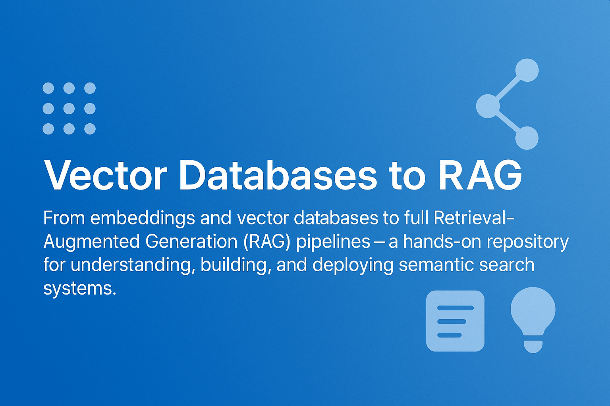

## 🧰 How to Use This Template

Click the green **"Use this template"** button at the top of the page, then choose **"Create a new repository"**.

This will create your own copy of this project, which you can modify freely — no need to fork!

---

<div align="center">
    
</div>

<h1 align="center">Vector Databases to RAG</h1>

A hands-on learning journey from **text embeddings** to **vector databases** to **RAG pipelines**. Learn with working Chroma examples, explore PGVector, Pinecone, and Qdrant conceptually, and build your first Retrieval-Augmented Generation pipeline — with runnable scripts, interactive notebooks, and step-by-step docs.

---

***Table of Contents***

<details>
  <summary><a href="#1-quick-start"><i><b>1. Quick Start</b></i></a></summary>
  <div>
    &nbsp;&nbsp;&nbsp;&nbsp;&nbsp;&nbsp;&nbsp;&nbsp;&nbsp;&nbsp;<a href="#11-prerequisites">1.1. Prerequisites</a><br>
    &nbsp;&nbsp;&nbsp;&nbsp;&nbsp;&nbsp;&nbsp;&nbsp;&nbsp;&nbsp;<a href="#12-setup-and-run">1.2. Setup and Run</a><br>
    &nbsp;&nbsp;&nbsp;&nbsp;&nbsp;&nbsp;&nbsp;&nbsp;&nbsp;&nbsp;<a href="#13-access-jupyter-in-browser">1.3. Access Jupyter in Browser</a><br>
    &nbsp;&nbsp;&nbsp;&nbsp;&nbsp;&nbsp;&nbsp;&nbsp;&nbsp;&nbsp;<a href="#14-update-environment">1.4. Update Environment</a><br>
  </div>
</details>
&nbsp;

<div>
  &nbsp;&nbsp;&nbsp;&nbsp;<a href="#2-repository-structure"><i><b>2. Repository Structure</b></i></a>
</div>
&nbsp;

<details>
  <summary><a href="#3-about-this-repository"><i><b>3. About this Repository</b></i></a></summary>
  <div>
    &nbsp;&nbsp;&nbsp;&nbsp;&nbsp;&nbsp;&nbsp;&nbsp;&nbsp;&nbsp;<a href="#learning-path">3.1. Learning Path</a><br>
    &nbsp;&nbsp;&nbsp;&nbsp;&nbsp;&nbsp;&nbsp;&nbsp;&nbsp;&nbsp;<a href="#who-is-this-for">3.2. Who Is This For?</a><br>
    &nbsp;&nbsp;&nbsp;&nbsp;&nbsp;&nbsp;&nbsp;&nbsp;&nbsp;&nbsp;<a href="#prerequisites">3.3. Prerequisites</a><br>
  </div>
</details>
&nbsp;

<details>
  <summary><a href="#4-examples"><i><b>4. Examples</b></i></a></summary>
  <div>
    &nbsp;&nbsp;&nbsp;&nbsp;&nbsp;&nbsp;&nbsp;&nbsp;&nbsp;&nbsp;<a href="#scripts">4.1. Scripts</a><br>
    &nbsp;&nbsp;&nbsp;&nbsp;&nbsp;&nbsp;&nbsp;&nbsp;&nbsp;&nbsp;<a href="#notebooks">4.2. Notebooks</a><br>
    &nbsp;&nbsp;&nbsp;&nbsp;&nbsp;&nbsp;&nbsp;&nbsp;&nbsp;&nbsp;<a href="#documentation">4.3. Documentation</a><br>
  </div>
</details>
&nbsp;

<div>
  &nbsp;&nbsp;&nbsp;&nbsp;<a href="#5-requirements"><i><b>5. Requirements</b></i></a>
</div>
&nbsp;

---

## 1. Quick Start

### 1.1 Prerequisites
- Docker and Docker Compose installed on your system
- VS Code with Dev Containers extension

### 1.2 Setup and Run

**Step 1: Clone and Navigate**
```bash
git clone <repository-url>
cd IRT_Item-Response-Theory
```

**Step 2: Build and Run Container**
```bash
# Make start.sh executable (if not already)
chmod +x start.sh

# Build and run the container
./start.sh
```

**Alternative method:**
```bash
docker-compose up --build -d
```

**Step 3: Verify Container**
```bash
docker-compose ps
```
Ensure the container status is "Up" and port 8888 is mapped.

**Step 4: Run Python Scripts**

```bash
# First, find your container name
docker-compose ps

# Enter the container and navigate to scripts directory
docker exec -it <container_name> bash
cd /app/scripts

# Run scripts one by one
python generate_irt_data.py
python example_irt_simulation.py
```

**Step 5: Work with Jupyter Notebooks**

1. **Attach VS Code to Container:**
   - Press `Ctrl+Shift+P` to open command palette
   - Select `Dev Containers: Attach to Running Container…`
   - Choose your project container
   - In the new VS Code window, click "Open Folder" → select `/root/app`
   - Install extensions: Docker, Dev Containers, Python, and Jupyter

2. **Select Kernel and Run Notebooks:**
   - Open `notebooks/1_IRT_Data_Generator.ipynb` or `notebooks/2_IRT_Exploratory_Analysis.ipynb`
   - Select the correct kernel (should auto-detect)
   - Start exploring IRT concepts by running cells!

**Step 6: Stop Container**
```bash
docker-compose down
```

### 1.3 Access Jupyter in Browser
Visit `localhost:8888/tree` to access Jupyter interface directly.

### 1.4 Update Environment
To rebuild with changes:
```bash
docker-compose up --build
```

To update dependencies:
```bash
# Inside container
pip freeze > requirements.txt
```

## 2. Repository Structure

```
.
+---data/                      <-- Sample datasets, embeddings, local Chroma store
|   README.md
|
+---docs/                      <-- Tutorial series: fundamentals to implementation
|   README.md
|   01_fundamentals.md
|   02_embedding_sources.md
|   03_vector_databases.md
|   04_use_cases.md
|   05_implementation_guide.md
|
+---notebooks/                 <-- Interactive Jupyter notebooks
|   README.md
|   01_embeddings_basics.ipynb
|   02_vector_db_comparison.ipynb
|   03_rag_pipeline.ipynb
|
+---scripts/                   <-- Runnable Python examples
|   README.md
|   embed_text.py
|   build_index_chroma.py
|   query_similarity.py
|   rag_example.py
|
+---.dockerignore
+---.gitignore
+---docker-compose.yml         <-- Docker Compose configuration
+---Dockerfile                 <-- Docker image definition
+---LICENSE
+---README.md                  <-- This file
+---requirements.txt           <-- Python dependencies
+---start.sh                   <-- Helper script to start container
```

## 3. About this Repository

This repository provides a practical learning path: **embeddings → vector storage → similarity search → RAG**.

### Learning Path

1. **Fundamentals**: Understand vectors, embeddings, and similarity metrics
2. **Embedding Sources**: Work with text embeddings using Sentence Transformers and OpenAI
3. **Vector Databases**: Compare Chroma, PGVector, Pinecone, and Qdrant
4. **Use Cases**: Build RAG pipelines, semantic search, and recommendation systems
5. **Implementation**: Hands-on scripts and notebooks with real examples

### Who Is This For?

- Developers learning vector databases and semantic search
- Data scientists exploring RAG (Retrieval-Augmented Generation)
- Anyone wanting to understand embeddings and similarity search

### Prerequisites

- Basic Python knowledge
- Docker installed and running
- VS Code with Dev Containers extension (recommended)

## 4. Examples

### Scripts

Located in `scripts/`:

- `embed_text.py` — Create embeddings for text using Sentence Transformers
- `build_index_chroma.py` — Index and query vectors with Chroma
- `query_similarity.py` — Compute cosine similarity between vectors
- `rag_example.py` — Minimal RAG pipeline example

See `scripts/README.md` for detailed usage.

### Notebooks

Located in `notebooks/`:

- `01_embeddings_basics.ipynb` — Create embeddings and measure similarity
- `02_vector_db_comparison.ipynb` — Hands-on comparison of vector databases
- `03_rag_pipeline.ipynb` — Build a complete RAG pipeline

See `notebooks/README.md` for details.

### Documentation

Comprehensive tutorial series in `docs/`:

- Fundamentals of vectors and embeddings
- Embedding models and sources
- Vector database comparison and selection
- Real-world use cases
- Implementation guide

Start with `docs/README.md` for the full curriculum.

## 5. Requirements

All Python dependencies are listed in `requirements.txt`:

- Core: `numpy`, `pandas`, `tqdm`
- Embeddings: `sentence-transformers`, `openai`
- Vector DBs: `chromadb`, `pgvector`, `qdrant-client`, `pinecone-client`
- Notebooks: `ipykernel`

Dependencies are automatically installed when building the Docker image.

## 6. Contact Information

For questions not addressed in the resources above or collaboration requests, please connect with [Mostafa Rezaee](https://www.linkedin.com/in/mostafa-rezaee/) on LinkedIn for personalized assistance.

---

**Note**: The Docker configuration (`Dockerfile`, `docker-compose.yml`) is part of the template and should not be modified. Only update `requirements.txt` to add or change dependencies.
